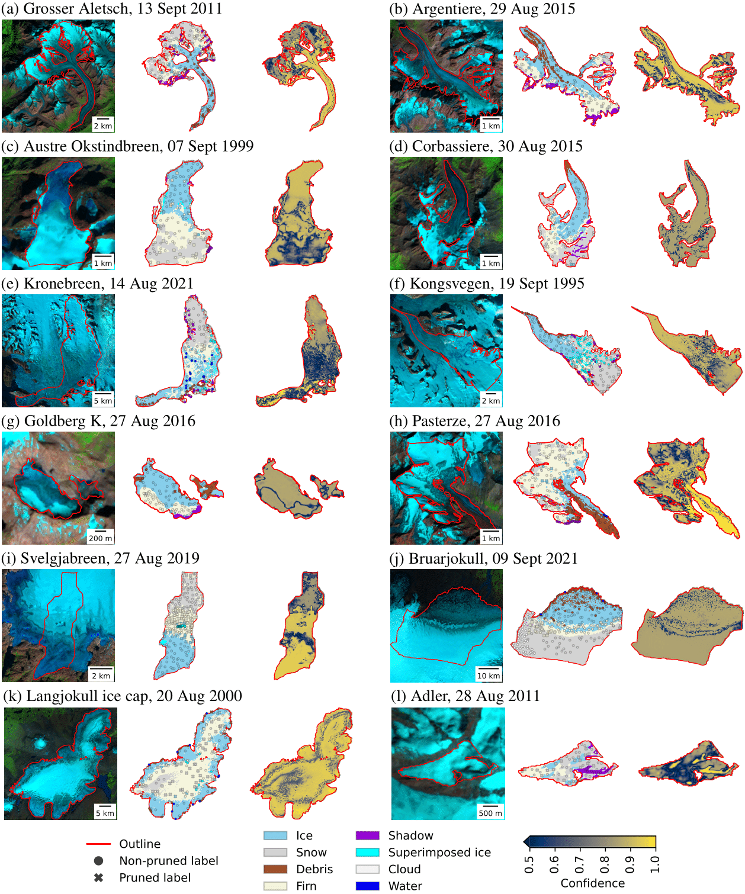

# Automating glacier facies classification: pan-European dataset and deep learning baseline

[Konstantin A. Maslov](https://people.utwente.nl/k.a.maslov), [Thomas Schellenberger](https://www.mn.uio.no/geo/english/people/aca/geohyd/thosche/), [Prashant Pandit](https://www.eurac.edu/en/people/prashant-pandit), [Claudio Persello](https://people.utwente.nl/c.persello), [Alfred Stein](https://people.utwente.nl/a.stein)

[[`Paper`]()] [[`Datasets`](#datasets)] [[`BibTeX`](#citing)] 

<br/>

**The repository is in progress!**



Glacier facies play a critical role in understanding the mass balance of glaciers, offering insights into accumulation and melting processes. 
Accurate mapping of glacier facies is therefore essential for monitoring glacier response to climate change and informing climate policies. 
In this study, we present the largest glacier facies dataset ever compiled for Europe, comprising 31 glaciers, 92 Landsat and Sentinel-2 scenes, 138273 expert point labels and eight classes&mdash;*ice*, *snow*, *debris*, *firn*, *shadow*, *superimposed ice*, *cloud* and *water*&mdash;encompassing a wide variety of surface conditions.
A confident learning method pruned 16% of ambiguous expert labels. 
A compact and straightforward convolutional neural network reached a macro-average F1 score of 78% on the cleaned data (or 69% on the full, unpruned data).
When the facies products were regressed against World Glacier Monitoring Service records, they showed moderate, yet significant correlation with the surface mass balance measurements globally (r = 0.63, RMSE = 0.61 m w.e., where m w.e. denotes metre of water equivalent) and competitive correspondence for glacier-specific calibration (r = 0.81, RMSE = 0.26 m w.e.).
By providing both the dataset and baseline classification models, we aim to support the broader community in developing more advanced methods for glacier facies mapping to enhance our understanding of ongoing glacial changes.

<br/>

## Datasets

## Getting started

## License

This software is licensed under the [GNU General Public License v2](LICENSE).


## Citing

To cite the paper/repository, please use the following bib entry. 

```
@article{
  ...
}
```
